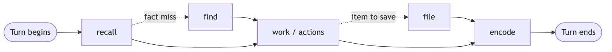
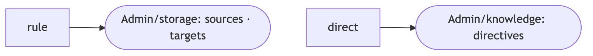
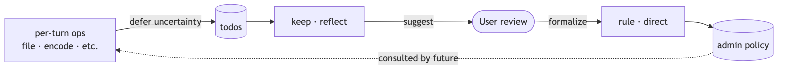

<!-- hero -->
<div align="center">

# CFS — Cognitive File System


An AI-native system for organizing and unlocking<br>your personal files and knowledge.

*An optimistic attempt at building a real digital self for the AI era.*

</div>

---

Your files are scattered. Your knowledge lives in your head or across dozens of tools. AI agents start every session from zero. CFS is our attempt at a principled solution to all three: a structured filesystem for stable storage, a knowledge layer for understanding and connection, and a shared foundation that gives both you and AI persistent context about your digital life, in a simple open structure entirely under your control.

## Vision

If CFS works as intended, what it aims to grow into over time is something closer to a personal digital twin — a quiet, structured mirror of the user's digital life. It captures context as it's encountered, organizes what's worth keeping, and stays available to both the user and any agents working on their behalf.

The intent is continuous learning. Files filed, decisions recorded, people and projects encountered, processes articulated — each turn leaves a trace, and the accumulated trace becomes a foundation that compounds. Over time, the user's digital self grows less scattered and more navigable; agents draw on real, persistent context instead of improvising from scratch, and act on it with the user's own organizing intent rather than generic defaults.

This is the direction, not a guarantee. CFS today is early and humble; the vision is what the design is reaching toward, if the principles hold up under broader use.

## Architecture

CFS is a set of plain-text instructions — a single [Agent Skill](https://agentskills.io) — that teaches any AI agent how to organize and retrieve your files and knowledge.

- **Open and inspectable.** Plain markdown files, no database, no proprietary format. Read it, fork it, or walk away with your data at any time.
- **Harness-agnostic.** Works with any AI agent that supports the Agent Skills standard — local models, private cloud, or hosted providers.
- **Runs in the background.** Loads silently into your normal AI sessions; not a separate app to switch into.
- **Yours by default.** Storage lives wherever you point it — local disk, private cloud, your own server.

Two independent layers, each valuable on its own:

**Storage** — a prescribed filesystem for stable, navigable file organization. Items route by entity (who or what they belong to), then by life domain or content type. The structure is simple enough to browse without AI, but designed for AI to operate fluently.

**Knowledge** — an Obsidian-compatible vault of linked markdown notes. Understanding, connections, and meaning that grow over time. Initially draws from the filesystem and from AI interactions (any session where the skill is loaded). Integration with further external sources — email, calendars, cloud services — can be configured through your agent harness's scheduled tasks, MCP tools, or other integrations.

Each layer organizes content into a small, browsable folder structure:

**Storage layout:**

```
.
├── Admin/                       per-layer operational state
│   ├── admin/                   logs, todo
│   ├── storage/                 logs, todo, sources, targets
│   └── knowledge/               logs, todo
├── Archive/                     items grouped by entity
│   └── [entity]/
│       └── [domain]/            items & collections
├── Projects/                    active project workspaces
│   └── [entity]/
│       └── [project]/
├── Library/                     items grouped by category
│   └── [category]/              items & collections
└── Unsorted/                    items awaiting processing
```

**Knowledge layout:**

```
Memory/
├── Episodic/                    events, decisions, journal
├── Semantic/                    entities: people, orgs, places, projects, things
└── Procedural/                  how-tos, processes, templates
```

**Flows.** Each layer exposes a small set of operations, mapped 1:1 to flow files at `flows/<layer>/<operation>.md`:

| Operation | Layer | What it does |
|---|---|---|
| `recall` | Knowledge | Look up relevant context from prior nodes before responding |
| `encode` | Knowledge | Capture facts, decisions, and events into knowledge nodes |
| `reflect` | Knowledge | Consolidate the knowledge graph — duplicates, gaps, weak links |
| `direct` | Knowledge | Persist a user directive about what knowledge should track |
| `file` | Storage | Route, name, and place an item into storage |
| `find` | Storage | Retrieve filed items by browsing or query |
| `keep` | Storage | Maintain storage health — drift, unsorted, deferred todos |
| `rule` | Storage | Persist a user-stated routing or naming preference |
| `setup` | Admin | Initialize or verify the environment |
| `test` | Admin | Validate flows against test cases |
| `update` | Admin | Update the CFS clone from upstream |

CFS operations break into three modes — a default per-turn rhythm that runs silently around normal AI use, periodic maintenance for storage and knowledge health, and user-led configuration that captures policies for future operations. The modes below describe typical invocation patterns; any operation can also be requested directly by the user at any time.

**Per-turn rhythm.** The agent silently *recalls* relevant context, performs the *work* (which may dispatch explicit operations like `file`), and silently *encodes* anything worth remembering. Two cross-layer chains support this — a fact-like recall miss falls back to `find` in storage, and `file` chains into `encode` so storage activity leaves a knowledge trace.

<picture>
  <source media="(prefers-color-scheme: dark)" srcset="docs/diagrams/per-turn-rhythm-dark.png">
  
</picture>

**Maintenance.** Manually invoked or scheduled, `keep` and `reflect` keep each layer healthy — `keep` reviews drift, processes Unsorted, and triages deferred todos; `reflect` consolidates duplicates, detects gaps, and strengthens connections in the knowledge graph.

<p align="center">
<picture>
  <source media="(prefers-color-scheme: dark)" srcset="docs/diagrams/maintenance-dark.png">
  
</picture>
</p>

**User-led configuration.** When the user states a routing or naming preference (`rule`) or a knowledge directive (`direct`), CFS persists it to the admin layer. Subsequent operations consult these admin files, so policy applies forward without the user having to repeat themselves.

<p align="center">
<picture>
  <source media="(prefers-color-scheme: dark)" srcset="docs/diagrams/configuration-dark.png">
  
</picture>
</p>

**Feedback loop.** The three modes feed each other. Regular operations defer uncertain decisions as todos; maintenance triages those todos and may surface rule or directive suggestions; accepted suggestions become configuration that shapes future regular operations.

<picture>
  <source media="(prefers-color-scheme: dark)" srcset="docs/diagrams/feedback-loop-dark.png">
  
</picture>

The entire system is readable by anyone — human or AI — in minutes. There is no hidden logic. The skill definition (`SKILL.md`) dispatches to flows, flows reference refs, refs define the rules.

## Influences

CFS draws from library science (Ranganathan, Dublin Core), archival science (ISO 15489, MPLP, records continuum, respect des fonds), personal information management (Bergman & Whittaker, Jones), organizational frameworks (PARA, Johnny Decimal, datacurator-filetree, GTD), cognitive neuroscience (Tulving, Squire), data modeling (Kimball, Linstedt), media naming standards (MusicBrainz Picard, Plex/Jellyfin, Calibre, No-Intro, Lightroom), the Agent Skills standard (Anthropic), and contemporary AI-era work (Karpathy, Ango, Dubois, Forte). See [docs/spec.md](docs/spec.md) for the full list with precise relationship descriptions.

## Safety

CFS is designed to be operated by AI agents across any backend — local, private cloud, or hosted. The risks vary by your setup, but apply universally:

- **Your data may be sent to third parties.** Unless you use a fully local LLM, file contents and metadata are sent to your AI provider for processing. Understand your provider's data handling before filing sensitive material.
- **Agents are non-deterministic.** The same input may produce different results across runs. Naming, routing, and organizational decisions involve judgment that can vary.
- **Agents can be wrong.** Misrouting, incorrect naming, false duplicate detection, and overconfident decisions are possible. Every output should be verified.
- **Agents are vulnerable to manipulation.** Prompt injection, adversarial filenames, and malicious content in source material can influence agent behavior in unintended ways.
- **Destructive outcomes are possible.** Despite safeguards, file operations can result in data loss, incorrect moves, or unintended deletions. Always maintain backups of source material.

CFS includes operational safeguards (non-destructive source handling, logging, user consent requirements — see [refs/admin/safety.md](refs/admin/safety.md)). These are operational rules the agent is instructed to follow, not hard sandbox guarantees, so they reduce risk rather than eliminate it.

**Disclaimer:** CFS is provided as-is under the MIT license. Use of this system, including any data processed by AI agents through it, is entirely at your own risk and responsibility.

## Getting started

CFS works with any AI agent harness and LLM backend that supports the [Agent Skills](https://agentskills.io) standard — local models, private cloud (e.g., AWS Bedrock), or hosted providers (e.g., Anthropic, OpenAI).

**1. Clone into your agent's skills directory:**

```bash
git clone https://github.com/skye-cp/cfs.git
```

Place the repo where your agent discovers skills. Ideally this should be a location that ensures the skill is loaded across all sessions, so the AI always has access to it — for Claude Code, this is typically a configured skills path. If you only want CFS available in a specific project, place it there instead.

**2. Run setup:**

Ask your AI agent to run the CFS setup flow. Setup will prompt you to configure storage locations, create the directory structure, confirm capabilities for each backend (using whatever the agent has — native, MCP, CLI, or an opt-in CFS-bundled tool), and optionally wire periodic maintenance flows to your harness's scheduler. See [flows/admin/setup.md](flows/admin/setup.md) for details.

**3. Start filing:**

Ask your agent to file items. Point it at a folder, a download, or a document — the file flow handles content extraction, routing, naming, and organization. CFS is instructed to copy from external sources into its managed space and to leave source material unchanged. Because this is a policy-level safety rule (not an absolute technical guarantee), keep backups and verify outcomes.

For a fuller walkthrough — operations, what runs silently, staged ingestion, maintenance rhythms — see [docs/usage.md](docs/usage.md).

## Documentation

- [docs/usage.md](docs/usage.md) — Day-to-day usage: operations, examples, first ingestion, maintenance.
- [docs/spec.md](docs/spec.md) — Full design specification: rationale, structure, influences, open questions.
- [flows/](flows/) — Operational flows: knowledge (recall, encode, reflect, direct), storage (find, file, keep, rule), admin (setup, test, update).
- [refs/](refs/) — Reference material organized by layer: admin (safety, logging), storage (routing, entities, naming, domains, categories, collections).
- [SKILL.md](SKILL.md) — Agent entry point.

CFS is in **alpha**. Both layers are v1 drafts in active use — functional and accumulating real content, with broader validation still ahead.

## Developing

CFS is designed to be worked on by both humans and AI agents. To contribute, ask your AI agent to follow the develop flow — or see [dev/develop.md](dev/develop.md) for onboarding, conventions, and workflow.

## License

MIT
