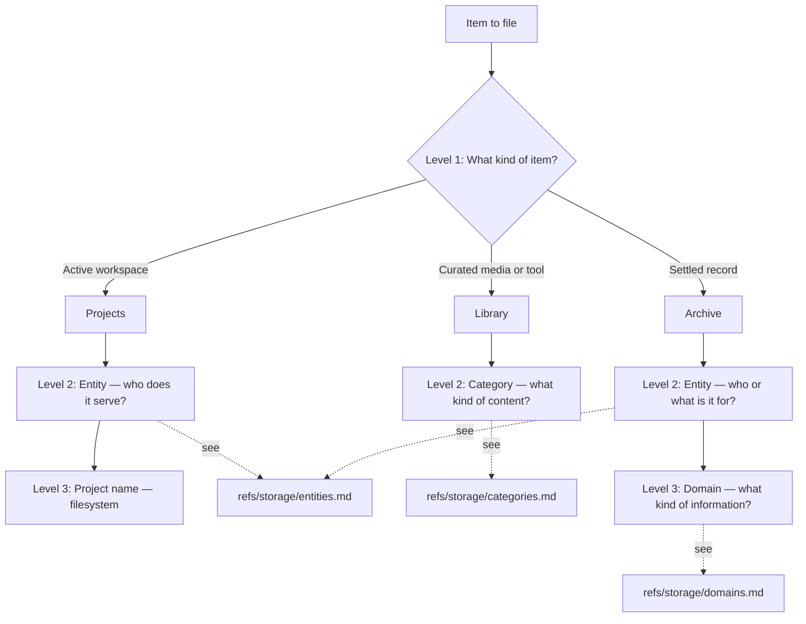

# Routing

Where an item goes in the CFS structure.

---

## Multi-location awareness

A storage class may have multiple configured locations (a default plus additional named locations in `config.yaml`). Whenever routing, finding, or maintaining requires inspecting the storage for a class — checking existing entities, looking for peers, searching for items — inspect every configured location for that class whose address (or matching mirror) belongs to a backend active in the current session. Locations on inactive backends are inert and soft-skipped per `refs/admin/safety.md` § Backend dispatch; they remain valid typed references but cannot be inspected from this environment. Dispatch on the address per the same rule.

Routing determines the storage class, entity, and domain/category. The specific location within a class is resolved separately by consulting `{admin}/storage/sources.md` for location directives. If no directive applies, the default location is used.

## Decision tree

## Level 1: Storage class

**What kind of item is this?**

| Question | If yes → | Next level |
|---|---|---|
| Is this an active workspace — being worked on, has a lifecycle? | **Projects** | Entity → Project name |
| Is this curated media or a tool — consumed, played, or used as software? | **Library** | Category |
| This is a settled record. | **Archive** | Entity → Domain |

## Level 2: Entity (Archive and Projects)

**Who or what is this record for?**

Both Archive and Projects route through entities — the primary beneficiary of the item. A project serves a client entity. An archive record belongs to an owner entity. The entity concept is the same for both.

Consult `refs/storage/entities.md` for the full entity concept, independence test, and resolution guidance. Consult the filesystem to check existing entities before creating a new one.

## Level 2: Category (Library)

**What kind of content is this?**

Library routes by content type, not by entity. Categories: Audio, Video, Images, Books, Games, Tools.

Consult `refs/storage/categories.md` for definitions and resolution guidance.

## Level 3: Domain (Archive)

**What kind of information is this?**

Archive entities are subdivided by domain. Each domain captures one kind of information: Identity, Finance, Health, Career, Clients, Assets, Legal, Events.

Consult `refs/storage/domains.md` for definitions, boundaries, and resolution guidance.

## Level 3: Project name (Projects)

**Which project?**

Consult the filesystem under the entity to check existing projects. Each project is a unit with its own internal structure — CFS organizes to the project level.

## Cross-cutting rules

- Insurance: policy → Legal, claim payment → Finance, medical records → Health
- Education: diplomas → Identity, coursework → Career
- Employment: contract → Career/[Employer], pay stubs → Finance, recommendation letters → Career
- Client engagement: contract → Clients/[Client], invoices issued → Clients/[Client], proposals → Clients/[Client]
- Correspondence: file by subject (bank letter → Finance, doctor letter → Health, client letter → Clients)
- Relationship test: is this about the entity itself, or about a relationship? If relationship → Career (trajectory through others) or Clients (trajectory with those served)
- Shared items: file under primary entity
- Business expense paid from personal account → business entity
- Medical record for family member received by system owner → family member's entity
- Property utility bill paid by the owner → property entity
- Vehicle insurance paid by the owner → vehicle entity
- Active event planning → Projects; settled event docs → Archive/Events

## The three-way split (example: bank account)

- The account exists → Assets (something you manage)
- The account terms → Legal (binding agreement)
- The account transactions → Finance (money moving)

## General rules

- **File by primary purpose** — not by topic, origin, or secondary use
- **When in doubt, file it** — imperfect location beats unfiled
- **Corrections are allowed** — re-route mistakes; don't relocate for status changes
